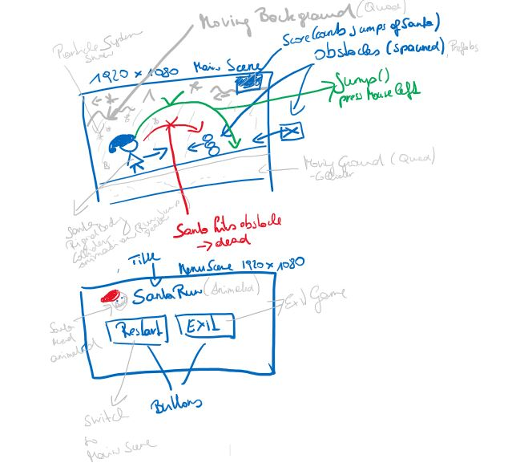

# Santa Run

### Project description: 
This is a simple 2D side-scroll game. The Santa runs from left to right and has to avoid some obstacles by jumping over them.
The game ends when the Santa hits an obstacle.  The goal is to avoid as many obstacles as possible.

### Development platform: 
Windows 10, Unity version 2019.1.14f1, Visual Studio Community 2017, Scripting Runtime Version: .NET 4.0

### Target platform: 
WebGl and Standalone, RefRes: 1920 * 1080

### Visuals: 

https://www.youtube.com/embed/2C74XxBkFfI

### Necessary setup/execution steps: 
For playing the game go to: 
* WebGL: https://hs-teaching.github.io/WegGL-SantaRun/
* Standalone (.exe): Clone project and publish as Standalone

For development: Clone this project. 

### Third party material: 
* This game is based on the game Santa Run developed by Raja Biswas in the Udemy-course Unity 2018 Game Developmen by Example 
[Unity 2018 Game Development by Example](https://www.udemy.com/course/unity-2d-game-development-by-example/).
* Sprites are used from https://www.gameart2d.com/santa-claus-free-sprites.html

### Project state: 
Program is working correctly, no errors, refactoring is needed.
Refactoring needed: 
* del not used namespaces
* del unused variables
* del needless debugs
* del needless comments
* del unused methods
* rename variables (coding standards)
* rename methods (coding standards)
* fix poor conditional clauses
* fix poor formating
* replace magic string
* replace magic number

### Limitations: 
Only one level is implemented. 

### Lessons Learned: 
* Create 2D Scenes
* Use Quads for moving Backgrounds (Textures instead of Sprites)
* Use Particle System for snowing effect.
* Use Scene Management for switching between Scenes
* Create and control Animations (Animation, Animator and Scripts)
* Use the singelton pattern
* Spawn objects
* Use UI elements and manipulate UI elements with scrips

Copyright by smeerws

# FRAGEN:
## Was ist Refactoring Definition in eigenen Worten?

Refactoring heißt es den Code aufzuräumen und übersichtlicher zu machen.

## Welche Vorteile/Nachteile birgt Refactoring?

Wenn man nach einer langen Zeit mal wieder über den Code schauen muss, kann ein nicht gerefactored Code
sehr verwirrend sein. Es kann jedoch auch sehr viel Zeit in anspruch nehmen.

## Was sind die Refactoring-Schritte?

Schauen ob alles funktioniert
Erster Schritt Code zu verbessern (zb. Magic Strings entfernen)
Testen ob Programm noch funktioniert
Committen
Nächster Schritt

## Prinzipien von guten Code?

KISS - Keep it simple stupid, Code sollte so simpel wie möglich sein 
DRY – Don’t Repeat Yourself, nicht unnötig dinge wiederholen
YAGNI – You Aren’t Gonna Need It, Dinge die nicht wirklich notwendig sind sollten entfernt werden
SoC – Separation of Concerns, Code sollte in Abschnitte unterteilt weden

## Was versteht man unter Code Smell?

Code der unnötig lange und umständlich geschrieben ist. Code Smells können oft fehleranfällig sein.

## Recherche von 10 Code Smells die Eure Projekt betreffen können, inkl. Beschreibung und Beispiel.
